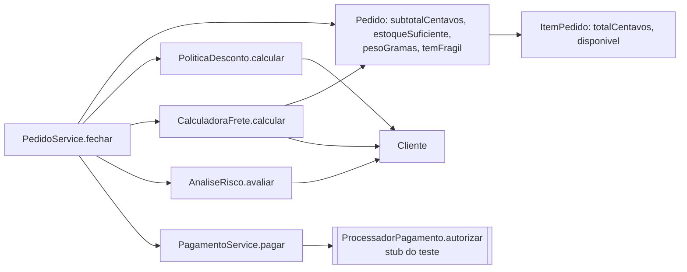
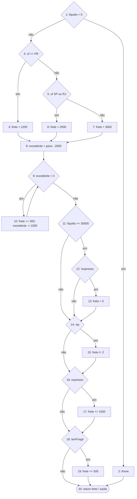
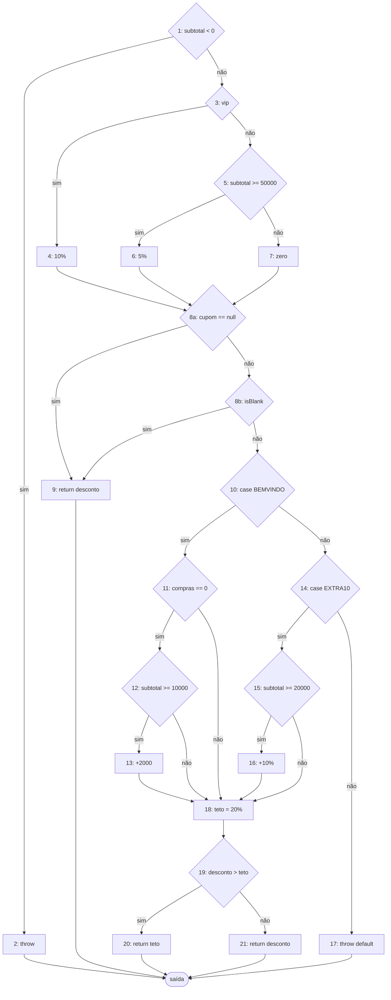
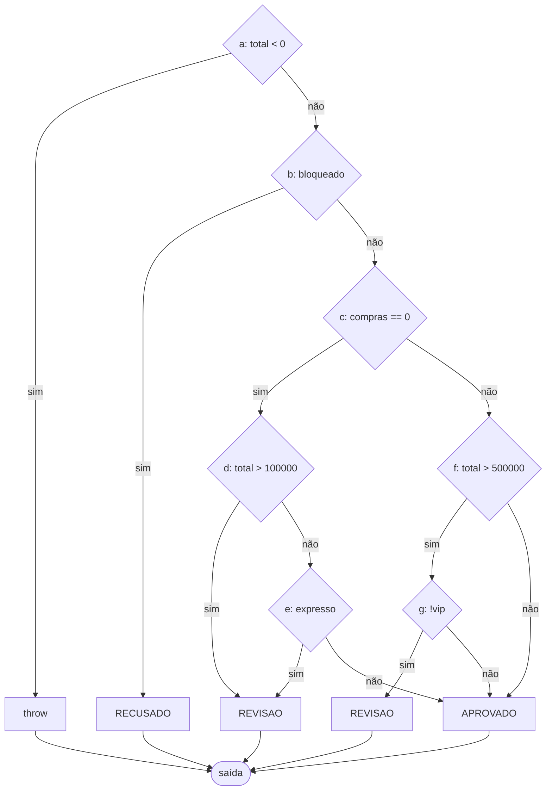
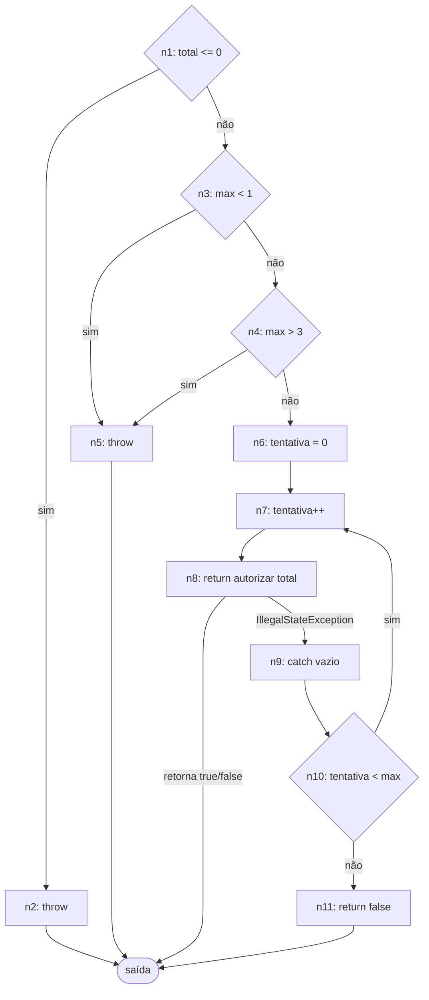
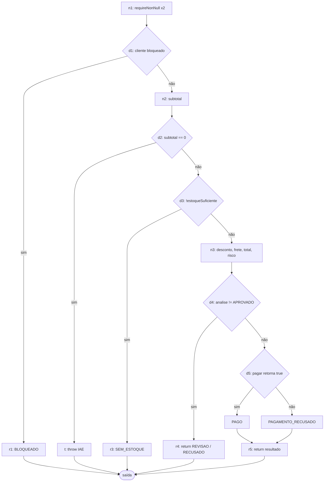

# Relatório do grupo

Integrantes: Eduardo Barella

## Grafos e complexidade

### Relacionamento entre classes e grafo de chamadas de `fechar`

`ResultadoPedido` é só o registro de saída. `Cliente`, `ItemPedido` e `Pedido` são registros com validação no construtor.

### Modelo adotado

- Cada **condição** de `&&`/`||` é um nó separado (curto-circuito explícito). Isso coincide com a contagem de complexidade do JaCoCo.
- Um `switch` de String é modelado por **grupos de rótulos**: `case "SP": case "RJ":` é uma única decisão.
- Todos os `return` e `throw` levam a **um único nó de saída**.
- Exceções implícitas (`NullPointerException` de `requireNonNull`, exceções vindas de outras classes) **não** são arestas, exceto o `catch` de `pagar`, que é essencial: sem a aresta de exceção o laço seria inalcançável.
- `V(G) = E − N + 2`; conferido com `decisões + 1`.

### CFG de `CalculadoraFrete.calcular` (N = 20, E = 28, V = 10)

### CFG de `PoliticaDesconto.calcular` (N = 23, E = 33, V = 12)

Decisões: `subtotal<0`; `vip`; `subtotal>=50000`; `cupom==null`; `cupom.isBlank()`; `case BEMVINDO`; `comprasAnteriores==0`; `subtotal>=10000`; `case EXTRA10`; `subtotal>=20000`; `desconto>teto` (o `default` lança exceção e é a saída da 2ª decisão do switch).

### CFG de `AnaliseRisco.avaliar` (N = 13, E = 19, V = 8)

### CFG de `PagamentoService.pagar` (N = 12, E = 16, V = 6 com aresta de exceção; 5 no JaCoCo)

O JaCoCo não conta o `catch` como branch (o `V` do JaCoCo é 5); o teste dessa aresta é feito por asserções sobre o número de chamadas.

### CFG de `PedidoService.fechar` (N = 16, E = 20, V = 6)

### Tabela de complexidade e base de caminhos

| Método | Nós | Arestas | V(G) | Caminhos independentes | Restrições de viabilidade |
| --- | --- | --- | --- | --- | --- |
| `CalculadoraFrete.calcular` | 20 | 28 | 10 | P1 `liquido<0` (throw); P2 PR/0 iter/sem adicionais (base); P3 SP; P4 MG (default); P5 excedente (1+ iterações); P6 `liquido>=30000` e normal (gratuito); P7 `liquido>=30000` e expresso (não zera); P8 VIP; P9 expresso; P10 frágil | Todos viáveis. `SP`/`RJ` compartilham o nó 5; testados os dois |
| `PoliticaDesconto.calcular` | 23 | 33 | 12 | P1 subtotal negativo; P2 VIP; P3 comum ≥ R$ 500; P4 comum < R$ 500; P5 cupom nulo; P6 cupom branco; P7 BEMVINDO elegível; P8 BEMVINDO com histórico; P9 BEMVINDO < R$ 100; P10 EXTRA10 elegível; P11 EXTRA10 < R$ 200; P12 cupom desconhecido; e `desconto > teto` verdadeiro/falso | Todos viáveis (VIP + BEMVINDO dispara o teto) |
| `AnaliseRisco.avaliar` | 13 | 19 | 8 | P1 total negativo; P2 bloqueado; P3 novo e `total>100000`; P4 novo, total baixo e expresso; P5 novo, total baixo e normal (APROVADO); P6 recorrente `total<=500000`; P7 recorrente `>500000` não VIP; P8 recorrente `>500000` VIP | P2 e P1 são inviáveis via serviço (ver análise crítica). Total negativo nunca chega do serviço |
| `PagamentoService.pagar` | 12 | 16 | 6 | P1 `total<=0`; P2 `max<1`; P3 `max>3`; P4 aprova/recusa na 1ª chamada; P5 exceção temporária e repete; P6 esgota tentativas (`false`) | Tudo viável. Outra exceção propaga pela aresta n8→saída sem passar pelo `catch` |
| `PedidoService.fechar` | 16 | 20 | 6 | P1 BLOQUEADO; P2 subtotal zero (IAE); P3 SEM_ESTOQUE; P4 REVISAO; P5 PAGAMENTO_RECUSADO; P6 PAGO (base) | O ramo `RECUSADO` de d4 é **inviável**: `bloqueado` já retornou em d1. Só REVISAO alcança d4=sim |

## Matriz de testes

Resumo por classe (nomes exatos dos métodos JUnit nos arquivos em `src/test/java/br/edu/ifpr/pedidos`). No total são 191 testes na execução completa, contando cada caso parametrizado.

| ID / método JUnit | Unidade | Entrada e estado do stub | Resultado esperado | Caminho / aresta | Critério atendido |
| --- | --- | --- | --- | --- | --- |
| `ClienteTest` (3) | `Cliente` | histórico −1 / 0 / 3 | IAE / aceita / guarda | validação do construtor | linhas, branches |
| `ItemPedidoTest` (29) | `ItemPedido` | SKU nulo/vazio/branco; preço 0, 1, 1.000.000, 1.000.001; qtd −1, 0, 100, 101; peso 0, 1, 100.000, 100.001; estoque −1, 0 | IAE fora do domínio; aceita nos limites; `totalCentavos` e `disponivel` (`<`, `=`, `>`) | cada `||` do construtor com operando direito avaliado e não | linhas, branches, curto-circuito, limites |
| `PedidoTest` (37) | `Pedido` | lista nula, 100, 101 linhas, elemento nulo; UF inválidas/válidas; inativos, frágil inativo, falta na 1ª/última linha | conforme contrato; cópia defensiva imutável | `for`: 0/1/várias linhas, `continue`, `break` | linhas, branches, laços |
| `PoliticaDescontoTest` (27) | `PoliticaDesconto` | limites 49.999/50.000, 9.999/10.000, 19.999/20.000; truncamento; cupom nulo/branco/minúsculo com espaços; desconhecido | valores em centavos calculados à mão; teto de 20% | P1–P12 e `desconto>teto` sim/não | linhas, branches, limites |
| `CalculadoraFreteTest` (29) | `CalculadoraFrete` | UF PR/SP/RJ/MG/ZZ; pesos 1.000, 2.000, 2.001, 3.000, 3.001, 4.000, 5.000, 100.000; líquido 29.999/30.000; VIP, expresso, frágil, combinações | valores tabelados | P1–P10, `while` 0/1/várias iterações; `&&` com 2º operando avaliado e não | linhas, branches, laço, decisões independentes |
| `AnaliseRiscoTest` (16) | `AnaliseRisco` | novos/recorrentes, VIP/não, bloqueado, limites 100.000/100.001 e 500.000/500.001, expresso | APROVADO / REVISAO / RECUSADO / IAE | P1–P8; cada operando de `||` e `&&` | linhas, branches, curto-circuito |
| `PagamentoServiceTest` (19) | `PagamentoService` | stub com roteiro: `true`; `false`; ISE→`true`; ISE,ISE→`true`; ISE×3; ISE→`false`; outra exceção; limites 1/2/3 | resultado + lista de totais recebidos (nº de chamadas) | P1–P6, `do/while` 1/várias vezes, `catch` | linhas, branches, exceções |
| `PedidoServiceTest` (31) | `PedidoService` (colaboração) | ver abaixo | status, subtotal, desconto, frete e total; `chamadas()` do stub | P1–P6 de `fechar` + integração com desconto/frete/risco/pagamento | linhas, branches, ordem das regras |

Colaboração pelo serviço (`PedidoServiceTest`): bloqueado (antes de itens e cupom), subtotal zero (lista vazia e só inativos), SEM_ESTOQUE (1ª e última linha; antes do cupom), cupom desconhecido, desconto VIP/comum/BEMVINDO/EXTRA10/teto/truncamento, frete com excedente + frágil + expresso, linhas inativas, SKU repetido, REVISAO (novo > R$ 1.000; novo expresso; não VIP > R$ 5.000), VIP > R$ 5.000 pago, pagamento recusado, ISE→pago, esgotamento (3 chamadas) e propagação de exceção. Em todos os desvios antes do pagamento o teste confere `stub.chamadas().isEmpty()`.

## Evolução da cobertura

Medida com `mvn clean test`; contadores do `jacoco.csv` (21 métodos e 9 classes concretas, contando construtores).

| Etapa | Testes executados | Linhas | Branches | Métodos | Classes | Lacunas e justificativas |
| --- | --- | --- | --- | --- | --- | --- |
| Inicial (só exemplo do roteiro) | 1 | 87/108 (81%) | 50/116 (43%) | 20/21 | 9/9 | Só o caminho PAGO com PR; desconto, frete e risco quase sem ramos |
| Unitários por classe (sem `PedidoServiceTest`) | 160 | 85/108 (79%) | 106/116 (91%) | 17/21 | 7/9 | `PedidoService` e `ResultadoPedido` nunca executadas (4 métodos e 23 linhas); os 10 branches faltantes são os de `PedidoService.fechar` |
| Completo (unitários + colaboração) | 191 | 108/108 (100%) | 116/116 (100%) | 21/21 | 9/9 | Nenhuma. `RECUSADO` via serviço é inviável, mas o ramo é coberto pelo teste unitário de `AnaliseRisco` |

## Análise crítica

- **Combinações que faltavam mesmo com ramos cobertos.** Em `CalculadoraFrete`, dois testes (um gratuito, um pago) cobrem ramos de gratuidade, VIP, expresso e frágil, mas deixam de fora combinações como gratuito + frágil (500) ou VIP + expresso (2.100, o expresso não é dividido). Elas têm testes próprios: `fragilIncideMesmoQuandoBaseFoiZerada`, `expressoNaoEhReduzidoPelaMetadeDoVip`, `deveCombinarVipExpressoEFragilComExcedenteDePeso`. Os ramos estariam 100% sem elas, mas um erro na ordem das etapas passaria despercebido.
- **Condições não avaliadas por curto-circuito.** Em `AnaliseRisco`, `total > 100000 || expresso`: com total alto, `expresso` não é lido; só o teste com total baixo e expresso verdadeiro o exercita. Em `total > 500000 && !vip`: com total ≤ 500.000 o `!vip` não é lido; VIP acima do limite é o único caso que o avalia como falso. Em `Pedido.temFragil`, `quantidade() > 0 && fragil()` só avalia `fragil()` para linhas ativas. Cada operando tem um teste dedicado.
- **Caminhos inviáveis no serviço, mas viáveis na unidade.** `AnaliseRisco` retorna `RECUSADO` para bloqueado, mas `PedidoService.fechar` já retorna `BLOQUEADO` antes de chamar o risco, então o serviço nunca produz `RECUSADO`. O mesmo vale para o total negativo em risco/frete/desconto: o serviço nunca o gera. `RECUSADO` e as exceções de valor negativo só são testados na unidade.
- **Exceções e iterações.** Exceções: `assertThrows` com o tipo exato; em `pagar` e `fechar` confere-se também que o processador **não** foi chamado (`chamadas().isEmpty()`). Como o JaCoCo não conta o `catch` como branch, o caminho de indisponibilidade foi validado pelo **número de chamadas** e pelos **valores recebidos** no stub (`ProcessadorStub`, que falha com `AssertionError` se chamado além do roteiro). Iterações: `while` do frete com 0, 1, 2, 3 e 98 iterações, kg exato (2.000, 3.000, 4.000) e fração (2.001, 3.001); `do/while` de pagamento com 1, 2 e 3 chamadas; `for` de `Pedido` com 0, 1 e várias linhas.
- **Exceção não representada no contador de branches.** `IllegalStateException` no `catch` de `pagar`, descrita acima.
- **Cobertura de ramos ≠ cobertura de caminhos.** Além do exemplo do frete acima, `fechar` tem 5 saídas de ramo e 100% de branches, mas as combinações de desconto × frete × risco × pagamento são bem mais numerosas. Os testes de colaboração escolhem uma base de 6 caminhos e valores derivados das regras, não da implementação.
- **Alteração proposital.** Em `CalculadoraFrete.calcular`, `liquido >= 30_000` foi trocado por `liquido > 30_000`. Falharam `deveZerarBaseEPesoNoLimiteDeTrezentosReais` (esperado 0, obtido 2.100), `vipComFreteGratisContinuaZerado` (0 vs 600) e `fragilIncideMesmoQuandoBaseFoiZerada` (500 vs 1.700). **A alteração foi desfeita**; o código de produção não foi modificado (`git status` só mostra arquivos em `src/test` e este relatório).
